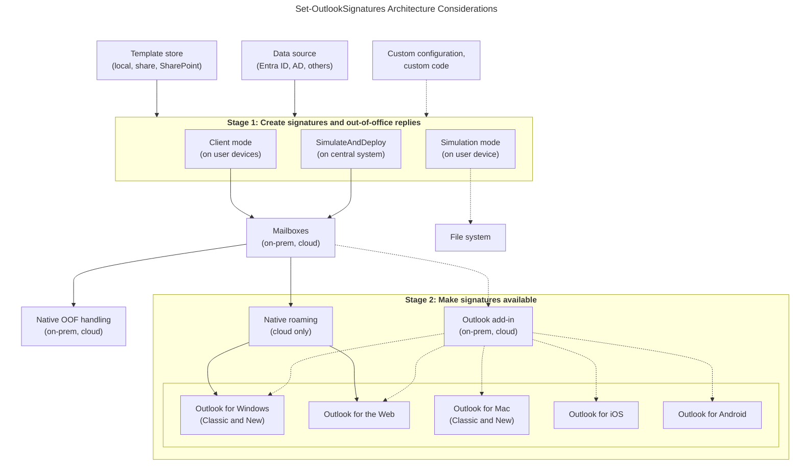
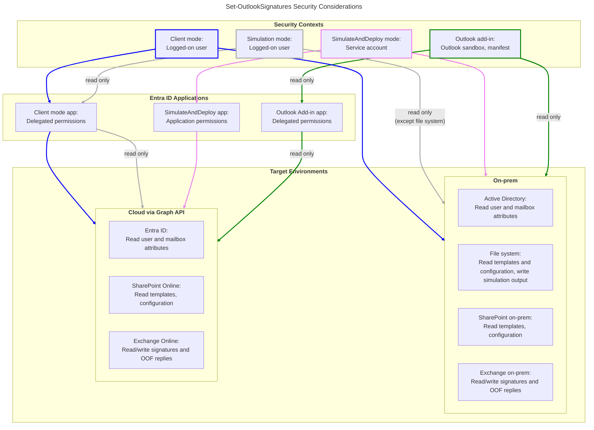

    

        

            

                ⚙️
                

                    
<b>IT</b>

                    
<a href="#architecture-considerations">Architecture considerations</a>

                    
<a href="#requirements-and-usage">Requirements and usage</a>

                

            

        

    

    

        

            

                🛡️
                

                    
<b>Security</b>

                    
<a href="#security-considerations">Security considerations</a>

                

            

        

    

  

    

      

        🚀
        

          
<b>Marketing</b>

          

            

                
<a href="#signature-and-oof-template-file-format">Signature and OOF template file format</a>

                
<a href="#replacement-variables">Replacement variables</a>

                
<a href="#ini-files-and-template-tags">Template tags and INI files</a>

            

            

                
<a href="#ini-files-and-template-tags">Template tags and INI files</a>

                
<a href="#signature-and-oof-application-order">Signature and OOF application order</a>

                
<a href="#simulation-mode">Simulation mode</a>

            

          

        

      

    

  

**Why parameters are in a separate document:** There are many [available parameters](/parameters), default values are chosen wisely, and custom values usually do not change over the years.

## Architecture considerations {#architecture-considerations}

The architecture of Set-OutlookSignatures is designed as a two-stage process: first, transforming raw templates into signatures and replies; second, ensuring these artifacts are delivered to the user's Outlook environment.  

**Stage 1: Create signatures and out-of-office replies** Signatures are generated using either decentralized (client mode) or centralized (SimulateAndDeploy) methods. This stage pulls template files from a store, enriches them with properties from Entra ID, Active Directory, or other data sources, and saves the result as signatures or out-of-office replies.  

**Stage 2: Make signatures available** The finished signatures and replies are made available to the user's Outlook instance, whether via native Outlook features or the [Outlook add-in](/outlookaddin).

**Flexibility in deployment** You can mix these approaches based on your architectural requirements:

- Mode Selection: Combine decentralized client mode and centralized SimulateAndDeploy mode based on your architecture principles.

- Delivery Channels: Use native Outlook features for signature roaming, or selectively configure and deploy the Outlook add-in.

  

<small><i>Click diagram to open it in a new tab.</i></small>

### Stage 1: Create signatures and out-of-office replies

Set-OutlookSignatures comes with **client mode**, the <a href="/benefactorcircle">Benefactor Circle add-on</a> adds **SimulateAndDeploy** mode.

  <table class="table  is-hoverable is-fullwidth">
    <thead>
      <tr>
        <th style="width: 15%;"></th>
        <th style="width: 42.5%;">Client mode</th>
        <th style="width: 42.5%;">SimulateAndDeploy</th>
      </tr>
    </thead>
    <tbody>
      <tr>
        <td><strong>Advantages</strong></td>
        <td>Uses idle resources on end user devices (Linux, Windows, macOS). Runs within the security context of the logged-on user. Is typically run more often, usually every two hours or at every log-on.</td>
        <td>Users do not need a primary device that is managed and runs Linux, macOS or Windows. Software or at least configuration must only be deployed to involved central systems.</td>
      </tr>
      <tr>
        <td><strong>Disadvantages</strong></td>
        <td>End users must log on to a device (Linux, Windows, macOS), not just to Outlook. The primary device of each user must be managed and run Windows, Linux or macOS. Software or at least configuration must be deployed to many decentral systems.</td>
        <td>Uses one or more central systems, which need appropriate resources. Runs within the security context of a service account requiring (temporary) full access to all user mailboxes. Is typically run less frequent, usually once a day or less often. Can only see and influence the configuration of Outlook for the web, reducing the feature set to what is possible without local Outlook state.</td>
      </tr>
      <tr>
        <td><strong>Recommended for</strong></td>
        <td>Users logging on to a primary device that is managed and runs Linux, Windows or macOS.</td>
        <td>Scenarios where you cannot or do not want to run Set-OutlookSignatures in the context of the logged-on user (shared devices, Outlook for the web only, mobile-only, unmanaged BYOD, etc.).</td>
      </tr>
    </tbody>
  </table>

&nbsp;

With the <a href="/benefactorcircle">Benefactor Circle add-on</a>, both modes can set **out-of-office replies** for internal and external recipients and also deploy signatures for mailboxes (and other Exchange recipient objects) the user can act as, even if they are not added as full mailboxes in Outlook (see the [VirtualMailboxConfigFile](/parameters#virtualmailboxconfigfile) parameter for details).

### Stage 2: Make signatures available

- **Client mode** automatically updates the local Outlook signature store.
- **SimulateAndDeploy** has no access to end user devices and therefore treats **Outlook for the web** as the “local Outlook”.

With the <a href="/benefactorcircle">Benefactor Circle add-on</a> active, both modes can additionally make signatures available via multiple channels:

- **Outlook for the web:** On-prem supports one signature (new email preferred). Cloud combines with roaming signatures.
- **Roaming Signatures;:** Exchange Online feature; stores multiple signatures in the mailbox.
- **Outlook Add-in:** For Android, iOS, and unmanaged BYOD devices; automatic signature selection based on sender and rules.
- **Draft Email:** Universal compatibility via copy-paste; stores all signatures in HTML and plain text in Drafts.
- **Documents Folder:** Exports signatures to a local path (e.g. OneDrive-synced) for easy access in non-Outlook clients.

## Requirements and usage {#requirements-and-usage}

  

    

      

        💻
        

          
<b>Core requirements</b>

          
<b>Exchange</b>: Exchange Online, Exchange on-premises, or Exchange hybrid

          
<b>PowerShell</b>: PowerShell 5.1 (<code>powershell.exe</code>) on Windows, or PowerShell 7+ (<code>pwsh.exe</code>, <code>pwsh</code>) cross-platform

        

      

    

  

  

    

      

        📝
        

          
<b>Outlook and Word (Windows)</b>

          
On Windows, Outlook and Word are <i>usually</i> required:

          <ul>
            <li>Outlook/New Outlook/OWA used as mailbox source.</li>
            <li><b>Word 2010+</b> required for <b>DOCX</b> templates or <b>RTF</b> signatures.</li>
          </ul>
        

      

    

  

  

    

      

        📄
        

          
<b>Templates</b>

          
Supported template formats:

          <ul>
            <li><b>DOCX</b> (Windows)</li>
            <li><b>HTM</b> (Windows, Linux, macOS)</li>
          </ul>
          
Set-OutlookSignatures ships with sample templates in both formats.

        

      

    

  

  

    

      

        🚀
        

          
<b>Execution environment</b>

          
The software must run in <b>PowerShell Full Language mode</b>.

          
On Windows and macOS, unblock <code>Set-OutlookSignatures.ps1</code> if needed (<code>Unblock-File</code> or file properties → Unblock).

        

      

    

  

  

    

      

        🛡️
        

          
<b>Endpoint security</b>

          
If you use application control (AppLocker, Defender, CrowdStrike, …), you may need to trust the existing digital file signature or allow execution/library loading from TEMP locations.

          
Set-OutlookSignatures and its components are digitally signed with an <b>EV Code Signing Certificate</b>.

        

      

    

  

  

    

      

        📂
        

          
<b>File access</b>

          
Paths to templates and config must be readable by the logged-in user.

          
For SharePoint Online access, register an Entra ID app and grant admin consent (see <a href="/quickstart">Quickstart</a>).

        

      

    

  

### Linux and macOS

Not all features are yet available or possible on Linux and macOS. Every parameter contains appropriate information; the most important restrictions are summarized here.

  

    

      

        ❗
        

          
<b>Common restrictions and notes for Linux and macOS</b>

          

            

              <ul>
                <li>Only mailboxes hosted in <b>Exchange Online</b> supported reliably.</li>
                <li>Only <b>Graph</b> is supported (<code>GraphOnly</code> is effectively <b>true</b>).</li>
                <li>Templates must be in <b>HTM</b> format (<code>UseHtmTemplates</code> is <b>true</b>).</li>
              </ul>
            

            

              <ul>
                <li>Only existing mount points and SharePoint paths can be accessed.</li>
                <li>Non-Outlook clients supported via <code>AdditionalSignaturePath</code>.</li>
                <li>OWA support requires the <a href="/benefactorcircle">Benefactor Circle add-on</a>.</li>
              </ul>
            

          

        

      

    

  

## Security considerations {#security-considerations}

### Required permissions

The security model of Set-OutlookSignatures and the <a href="/benefactorcircle">Benefactor Circle add-on</a> is built on the principles of **Digital Sovereignty**, **Least Privilege**, and **Need to Know**.

- In **client mode**, operations run entirely within the security context of the currently logged-on user, including access to Exchange on-prem mailboxes.
- In **SimulateAndDeploy mode**, operations run within the security context of the designated service account, including access to Exchange on-prem mailboxes.
- The **Outlook add-in** is contained within Outlook's restricted security model for the account accessing the mailbox.
- In **all modes** as well as in the **Outlook add-in**, communication with **Exchange Online** is routed through dedicated Entra ID applications to restrict permissions even further.

  

<small><i>Click diagram to open it in a new tab.</i></small>

  

    <strong>Detailed Entra ID app permissions</strong>
  

  

    <table class="table is-hoverable is-fullwidth">
      <thead>
        <tr>
          <th style="width: 25%;">Permission</th>
          <th style="width: 15%;">Client mode</th>
          <th style="width: 15%;">SimulateAndDeploy</th>
          <th style="width: 15%;">Outlook add‑in</th>
          <th>Required for</th>
        </tr>
      </thead>
      <tbody>
        <tr>
          <td colspan="5"><strong>All environments</strong></td>
        </tr>
        <tr>
          <td>Temporary full access to mailboxes</td>
          <td></td>
          <td>● Required</td>
          <td></td>
          <td>Access to roaming signatures in Exchange Online. Direct-to-mailbox sync on-prem.</td>
        </tr>
        <tr>
          <td>Add-in manifest, <a href="https://learn.microsoft.com/en-us/office/dev/add-ins/outlook/understanding-outlook-add-in-permissions">ReadWriteMailbox</a></td>
          <td></td>
          <td></td>
          <td>● Required</td>
          <td>Set signature.</td>
        </tr>
        <tr>
          <td colspan="5" style="padding-top: 2em !important;"><strong>Cloud only Entra ID app</strong> (creating a separate app for each mode is strongly recommended)</td>
        </tr>
        <tr>
          <td colspan="5"><em>Setup</em></td>
        </tr>
        <tr>
          <td>Manual setup</td>
          <td><a href="https://raw.githubusercontent.com/Set-OutlookSignatures/Set-OutlookSignatures/refs/heads/main/src_Set-OutlookSignatures/config/default%20graph%20config.ps1">Graph config file</a></td>
          <td><a href="https://raw.githubusercontent.com/Set-OutlookSignatures/Set-OutlookSignatures/refs/heads/main/src_Set-OutlookSignatures/sample%20code/SimulateAndDeploy.ps1">SimulateAndDeploy</a></td>
          <td><a href="/outlookaddin#entra-id-app">Outlook add-in</a></td>
          <td></td>
        </tr>
        <tr>
          <td>Scripted setup</td>
          <td><a href="https://raw.githubusercontent.com/Set-OutlookSignatures/Set-OutlookSignatures/refs/heads/main/src_Set-OutlookSignatures/sample%20code/Create-EntraApp.ps1">Create-EntraApp.ps1</a></td>
          <td><a href="https://raw.githubusercontent.com/Set-OutlookSignatures/Set-OutlookSignatures/refs/heads/main/src_Set-OutlookSignatures/sample%20code/Create-EntraApp.ps1">Create-EntraApp.ps1</a></td>
          <td><a href="https://raw.githubusercontent.com/Set-OutlookSignatures/Set-OutlookSignatures/refs/heads/main/src_Set-OutlookSignatures/sample%20code/Create-EntraApp.ps1">Create-EntraApp.ps1</a></td>
          <td></td>
        </tr>
        <tr>
          <td colspan="5" style="padding-top: 2em !important;"><em>Graph API permissions, delegated</em></td>
        </tr>
        <tr>
          <td><a href="https://learn.microsoft.com/en-us/graph/permissions-reference#email">email</a></td>
          <td>● Required</td>
          <td>● Required</td>
          <td></td>
          <td>Authenticate the signed-in user.</td>
        </tr>
        <tr>
          <td><a href="https://learn.microsoft.com/en-us/graph/permissions-reference#filesreadall">Files.Read.All</a></td>
          <td>○ Optional</td>
          <td>○ Optional</td>
          <td></td>
          <td>Read template and configuration files hosted on SharePoint Online. Alternative: <a href="https://learn.microsoft.com/en-us/graph/permissions-reference#filesselectedoperationsselected">Files.SelectedOperations.Selected</a>.</td>
        </tr>
        <tr>
          <td><a href="https://learn.microsoft.com/en-us/graph/permissions-reference#groupmemberreadall">GroupMember.Read.All</a></td>
          <td>● Required</td>
          <td>● Required</td>
          <td>● Required</td>
          <td>Find groups by name, get their security identifier (SID) and transitive members.</td>
        </tr>
        <tr>
          <td><a href="https://learn.microsoft.com/en-us/graph/permissions-reference#mailread">Mail.Read</a></td>
          <td></td>
          <td></td>
          <td>● Required</td>
          <td>Required because of Microsoft restrictions accessing roaming signatures.</td>
        </tr>
        <tr>
          <td><a href="https://learn.microsoft.com/en-us/graph/permissions-reference#mailreadwrite">Mail.ReadWrite</a></td>
          <td>● Required</td>
          <td>● Required</td>
          <td></td>
          <td>Create signature collection in drafts, provide signatures for Outlook add-in.</td>
        </tr>
        <tr>
          <td><a href="https://learn.microsoft.com/en-us/graph/permissions-reference#mailboxconfigitemreadwrite">MailboxConfigItem.ReadWrite</a></td>
          <td>● Required</td>
          <td>● Required</td>
          <td></td>
          <td>Read data from Outlook Web, set Outlook web signatures.</td>
        </tr>
        <tr>
          <td><a href="https://learn.microsoft.com/en-us/graph/permissions-reference#mailboxsettingsreadwrite">MailboxSettings.ReadWrite</a></td>
          <td>● Required</td>
          <td>● Required</td>
          <td></td>
          <td>Detect mailbox environment, get and set out-of-office data.</td>
        </tr>
        <tr>
          <td><a href="https://learn.microsoft.com/en-us/graph/permissions-reference#offline_access">offline_access</a></td>
          <td>● Required</td>
          <td>● Required</td>
          <td></td>
          <td>Get a refresh token from Graph.</td>
        </tr>
        <tr>
          <td><a href="https://learn.microsoft.com/en-us/graph/permissions-reference#openid">openid</a></td>
          <td>● Required</td>
          <td>● Required</td>
          <td></td>
          <td>Authenticate the signed-in user.</td>
        </tr>
        <tr>
          <td><a href="https://learn.microsoft.com/en-us/graph/permissions-reference#profile">profile</a></td>
          <td>● Required</td>
          <td>● Required</td>
          <td></td>
          <td>Authenticate the signed-in user, get basic properties.</td>
        </tr>
        <tr>
          <td><a href="https://learn.microsoft.com/en-us/graph/permissions-reference#userreadall">User.Read.All</a></td>
          <td>● Required</td>
          <td>● Required</td>
          <td>● Required</td>
          <td>Data for replacement variables, SMTP to UPN, group membership.</td>
        </tr>
        <tr>
          <td colspan="5" style="padding-top: 2em !important;"><em>Graph API permissions, application</em></td>
        </tr>
        <tr>
          <td><a href="https://learn.microsoft.com/en-us/graph/permissions-reference#filesreadall">Files.Read.All</a></td>
          <td></td>
          <td>○ Optional</td>
          <td></td>
          <td>Read template and configuration files hosted on SharePoint Online. Alternative: <a href="https://learn.microsoft.com/en-us/graph/permissions-reference#filesselectedoperationsselected">Files.SelectedOperations.Selected</a>.</td>
        </tr>
        <tr>
          <td><a href="https://learn.microsoft.com/en-us/graph/permissions-reference#groupmemberreadall">GroupMember.Read.All</a></td>
          <td></td>
          <td>● Required</td>
          <td></td>
          <td>Find groups by name, get their security identifier (SID) and transitive members.</td>
        </tr>
        <tr>
          <td><a href="https://learn.microsoft.com/en-us/graph/permissions-reference#mailreadwrite">Mail.ReadWrite</a></td>
          <td></td>
          <td>● Required</td>
          <td></td>
          <td>Create signature collection in drafts, provide signatures for Outlook add-in.</td>
        </tr>
        <tr>
          <td><a href="https://learn.microsoft.com/en-us/graph/permissions-reference#mailboxconfigitemreadwrite">MailboxConfigItem.ReadWrite</a></td>
          <td></td>
          <td>● Required</td>
          <td></td>
          <td>Read data from Outlook Web, set Outlook web signatures.</td>
        </tr>
        <tr>
          <td><a href="https://learn.microsoft.com/en-us/graph/permissions-reference#mailboxsettingsreadwrite">MailboxSettings.ReadWrite</a></td>
          <td></td>
          <td>● Required</td>
          <td></td>
          <td>Detect mailbox environment, get and set out-of-office data.</td>
        </tr>
        <tr>
          <td><a href="https://learn.microsoft.com/en-us/graph/permissions-reference#userreadall">User.Read.All</a></td>
          <td></td>
          <td>● Required</td>
          <td></td>
          <td>Data for replacement variables, SMTP to UPN, group membership.</td>
        </tr>
      </tbody>
    </table>
  

### Security questionnaire

Security reviews often share a basic set of questions. The overview below provides concise, written answers for both the Set-OutlookSignatures community project and the commercial Benefactor Circle add-on. Security analysts, procurement teams, and technical reviewers can start from a consistent baseline and refine the content where environment-specific requirements apply.

  

    <strong>Basic questions and answers</strong>
  

  
<a href="https://set-outlooksignatures.com">Set-OutlookSignatures</a> is the free and open-source community project for centrally generating and deploying Outlook email signatures.

  
The <a href="https://set-outlooksignatures.com/benefactorcircle">Benefactor Circle add-on</a> is a commercial proprietary add-on that extends Set-OutlookSignatures with additional enterprise capabilities, offered by <a href="https://explicitconsulting.at">ExplicIT Consulting</a>.

  <table>
    <thead>
      <tr>
        <th>Question</th>
        <th>Answer for Set-OutlookSignatures</th>
        <th>Answer for Benefactor Circle add-on</th>
      </tr>
    </thead>
    <tbody>
      <tr>
        <td>Are releases cryptographically signed?</td>
        <td>
Yes. Shipped executable components such as PowerShell scripts and DLLs are signed with an Extended Validation code-signing certificate. SHA-256 release hashes are published for release archives, and each release includes hashes.txt with per-file hashes so integrity can be verified before use.

Relevant URLs: <a href="https://github.com/Set-OutlookSignatures/Set-OutlookSignatures/releases">https://github.com/Set-OutlookSignatures/Set-OutlookSignatures/releases</a>, <a href="https://github.com/Set-OutlookSignatures/Set-OutlookSignatures/">https://github.com/Set-OutlookSignatures/Set-OutlookSignatures/</a>
</td>
        <td>
Yes. The add-on is delivered within the same release ecosystem and uses the same documented integrity controls for shipped executable components: Extended Validation code signing, SHA-256 release hashes, and hashes.txt with per-file hashes. The Outlook add-in is additionally deployed in a version-controlled manner under customer administrative control.

Relevant URLs: <a href="https://github.com/Set-OutlookSignatures/Set-OutlookSignatures/releases">https://github.com/Set-OutlookSignatures/Set-OutlookSignatures/releases</a>, <a href="https://set-outlooksignatures.com/outlookaddin">https://set-outlooksignatures.com/outlookaddin</a>
</td>
      </tr>
      <tr>
        <td>How is integrity verified before deployment?</td>
        <td>
Integrity is verified before deployment by checking the published SHA-256 hash for the release archive, validating the per-file hashes in hashes.txt, and verifying the digital signatures on shipped executable components such as PowerShell scripts and DLLs.

Relevant URLs: <a href="https://github.com/Set-OutlookSignatures/Set-OutlookSignatures/releases">https://github.com/Set-OutlookSignatures/Set-OutlookSignatures/releases</a>, <a href="https://github.com/Set-OutlookSignatures/Set-OutlookSignatures/">https://github.com/Set-OutlookSignatures/Set-OutlookSignatures/</a>
</td>
        <td>
Integrity is verified before deployment through the same controls used for the shared release package: SHA-256 release hashing, per-file validation through hashes.txt, and code signing of shipped executable components. For the Outlook add-in, integrity and change control are additionally supported through customer-managed hosting and explicit version-controlled deployment.

Relevant URLs: <a href="https://github.com/Set-OutlookSignatures/Set-OutlookSignatures/releases">https://github.com/Set-OutlookSignatures/Set-OutlookSignatures/releases</a>, <a href="https://set-outlooksignatures.com/outlookaddin">https://set-outlooksignatures.com/outlookaddin</a>
</td>
      </tr>
      <tr>
        <td>Is a Software Bill of Materials (SBOM) available?</td>
        <td>
Yes, in practical terms. Set-OutlookSignatures is shipped as a self-contained collection of software, and the deps folder acts as a practical SBOM because it contains one subfolder per dependency. The main script, configuration files, and files in the sample code folder are also documented both in the public documentation and within the files themselves.

Relevant URLs: <a href="https://github.com/Set-OutlookSignatures/Set-OutlookSignatures/releases">https://github.com/Set-OutlookSignatures/Set-OutlookSignatures/releases</a>, <a href="https://set-outlooksignatures.com/details">https://set-outlooksignatures.com/details</a>, <a href="https://set-outlooksignatures.com/help">https://set-outlooksignatures.com/help</a>
</td>
        <td>
Yes, by dependency on the base package. The add-on does not introduce a separate general dependency inventory beyond Set-OutlookSignatures itself, so the dependency transparency of the underlying Set-OutlookSignatures package also covers the runtime foundation of the add-on.

Relevant URLs: <a href="https://set-outlooksignatures.com/benefactorcircle">https://set-outlooksignatures.com/benefactorcircle</a>, <a href="https://github.com/Set-OutlookSignatures/Set-OutlookSignatures/releases">https://github.com/Set-OutlookSignatures/Set-OutlookSignatures/releases</a>
</td>
      </tr>
      <tr>
        <td>What third-party dependencies are required and how are they vetted?</td>
        <td>
Set-OutlookSignatures is shipped as a self-contained package. Third-party dependencies are included in the package itself, primarily in the deps folder, where one subfolder corresponds to one dependency, making the dependency set transparent and reviewable. Dependencies are included only in specific reviewed versions in the distributed package.

Dependency changes are documented in versioned releases, and the package is distributed with hashes and code signing so it can be reviewed before deployment.

Relevant URLs: <a href="https://github.com/Set-OutlookSignatures/Set-OutlookSignatures/releases">https://github.com/Set-OutlookSignatures/Set-OutlookSignatures/releases</a>, <a href="https://set-outlooksignatures.com/details">https://set-outlooksignatures.com/details</a>
</td>
        <td>
The add-on does not introduce a separate additional third-party dependency stack beyond the dependency foundation already delivered with Set-OutlookSignatures, except for the Outlook add-in, which has its own npm and JavaScript-based dependencies. Those are likewise shipped in specific reviewed versions and maintained through the same controlled release process.

Relevant URLs: <a href="https://set-outlooksignatures.com/outlookaddin">https://set-outlooksignatures.com/outlookaddin</a>, <a href="https://github.com/Set-OutlookSignatures/Set-OutlookSignatures/releases">https://github.com/Set-OutlookSignatures/Set-OutlookSignatures/releases</a>
</td>
      </tr>
      <tr>
        <td>How are upstream dependency vulnerabilities monitored and remediated?</td>
        <td>
Every upstream dependency is included in a specific, hand-selected version as part of the shipped package. Dependency vulnerabilities are monitored regularly and manually, supported by GitHub Dependabot, Renovate, and Snyk, and by reviewing relevant security-focused websites and newsletters. When an issue is identified, the affected dependency is updated to a reviewed version and shipped in a new release of the self-contained package.

Relevant URLs: <a href="https://github.com/Set-OutlookSignatures/Set-OutlookSignatures/releases">https://github.com/Set-OutlookSignatures/Set-OutlookSignatures/releases</a>, <a href="https://github.com/Set-OutlookSignatures/Set-OutlookSignatures/blob/main/docs/CHANGELOG.md">https://github.com/Set-OutlookSignatures/Set-OutlookSignatures/blob/main/docs/CHANGELOG.md</a>
</td>
        <td>
The same principles apply to the add-on. The Outlook add-in has its own npm and JavaScript-based dependencies, which are also monitored regularly and manually, supported by GitHub Dependabot, Renovate, and Snyk, and by reviewing relevant security websites and newsletters. When an issue is identified, the affected dependency is updated to a reviewed version and shipped in a new release.

Relevant URLs: <a href="https://github.com/Set-OutlookSignatures/Set-OutlookSignatures/releases">https://github.com/Set-OutlookSignatures/Set-OutlookSignatures/releases</a>, <a href="https://set-outlooksignatures.com/outlookaddin">https://set-outlooksignatures.com/outlookaddin</a>
</td>
      </tr>
      <tr>
        <td>What permissions are required to run the solution (user vs admin)?</td>
        <td>
Set-OutlookSignatures normally runs in the security context of the logged-on user. In standard client mode, day-to-day execution is therefore user-context, not local administrator context. For on-premises client-side use, no Graph registration is required. Where Graph-backed scenarios are used, Entra ID administrator rights are only required once to create and consent the required Entra ID app during setup. After that one-time setup, normal operation is designed to run in user context.

The detailed permission model is documented here: <a href="https://set-outlooksignatures.com/details#security-considerations">https://set-outlooksignatures.com/details#security-considerations</a>
</td>
        <td>
The add-on supports two permission models, depending on deployment mode. In client mode, it follows the same model as Set-OutlookSignatures and runs in the security context of the logged-on user. In SimulateAndDeploy mode, it runs centrally in the security context of a service account and requires temporary full access to the target user mailboxes to create and deploy signatures and out-of-office settings centrally. The Outlook add-in itself runs in the security context of the user. Where Exchange Online is used, Entra ID administrator rights are only required once during initial setup to create and consent the required Entra ID apps.

The detailed permission model is documented here: <a href="https://set-outlooksignatures.com/details#security-considerations">https://set-outlooksignatures.com/details#security-considerations</a>, <a href="https://set-outlooksignatures.com/outlookaddin">https://set-outlooksignatures.com/outlookaddin</a>
</td>
      </tr>
      <tr>
        <td>Does the solution make persistent system changes (scheduled tasks, registry, startup scripts)?</td>
        <td>
Persistent configuration and content changes are made where directly required for the function of the software, but the product does not require or inherently auto-create scheduled tasks or startup scripts. It can be run via logon script, scheduled task, or other customer-selected deployment mechanisms, depending on how the customer chooses to operate it.

It writes signatures to the local Outlook signature store and can also persist signature content to additional configured locations. In Classic Outlook for Windows, it can also set user-level HKCU registry values where required for signature handling.

Relevant URLs: <a href="https://set-outlooksignatures.com/features">https://set-outlooksignatures.com/features</a>, <a href="https://set-outlooksignatures.com/details">https://set-outlooksignatures.com/details</a>, <a href="https://set-outlooksignatures.com/faq">https://set-outlooksignatures.com/faq</a>
</td>
        <td>
The add-on follows the same principle, but with additional persistent changes in mailbox-based and centralized deployment scenarios. It does not inherently require or auto-create scheduled tasks or startup scripts, although it can be operated through customer-chosen mechanisms such as logon scripts, scheduled tasks, or central execution models.

In client mode, it can make the same kinds of persistent local changes as Set-OutlookSignatures. In addition, it can persist signatures and related data to Outlook Web, roaming signatures, Drafts, additional signature paths, and mailbox-resident data used by the Outlook add-in. In SimulateAndDeploy mode, it primarily makes mailbox-side persistent changes rather than end-user device changes. The Outlook add-in is deployed through manifest-based add-in deployment and customer-managed hosting rather than startup scripts.

Relevant URLs: <a href="https://set-outlooksignatures.com/details">https://set-outlooksignatures.com/details</a>, <a href="https://set-outlooksignatures.com/outlookaddin">https://set-outlooksignatures.com/outlookaddin</a>
</td>
      </tr>
      <tr>
        <td>How is code execution protected against tampering or unauthorized modification?</td>
        <td>
Code execution is protected through code signing, hash-based integrity verification, and customer-controlled deployment. Shipped executable components such as PowerShell scripts and DLLs are digitally signed with an Extended Validation code-signing certificate, and each release includes a SHA-256 hash for the release archive together with hashes.txt containing per-file hashes. This allows customers to verify that the package and executable files have not been altered before execution or deployment.

Set-OutlookSignatures is also delivered as a self-contained package with included, version-pinned dependencies, so code execution does not depend on uncontrolled live dependency retrieval at runtime. The quickstart explicitly supports the use of application control solutions by trusting the existing digital file signature.

Relevant URLs: <a href="https://github.com/Set-OutlookSignatures/Set-OutlookSignatures/releases">https://github.com/Set-OutlookSignatures/Set-OutlookSignatures/releases</a>, <a href="https://set-outlooksignatures.com/quickstart">https://set-outlooksignatures.com/quickstart</a>, <a href="https://set-outlooksignatures.com/details">https://set-outlooksignatures.com/details</a>
</td>
        <td>
The same protection principles are used for shipped executable components: Extended Validation code signing, SHA-256 release hashing, per-file hashes in hashes.txt, and customer-side verification before deployment. Because the add-on depends on Set-OutlookSignatures, it benefits from the same self-contained, version-pinned packaging approach for the underlying execution base.

For the Outlook add-in, protection against tampering is additionally supported by customer-managed hosting, explicit version-controlled deployment, and manifest-based rollout. This means the customer controls which add-in files are published, from which host they are served, and when a new version is made available to clients.

Relevant URLs: <a href="https://github.com/Set-OutlookSignatures/Set-OutlookSignatures/releases">https://github.com/Set-OutlookSignatures/Set-OutlookSignatures/releases</a>, <a href="https://set-outlooksignatures.com/outlookaddin">https://set-outlooksignatures.com/outlookaddin</a>
</td>
      </tr>
      <tr>
        <td>Has the code undergone any formal security testing (SAST/DAST, code review)?</td>
        <td>
Yes. Set-OutlookSignatures is subject to manual code review and the codebase is available for peer review as part of the open-source development model. The core is described as peer-reviewable and audit-ready, and the full source code, release history, and security process are published openly.

Static analysis practices are also used in development. The main PowerShell code explicitly contains PSScriptAnalyzer-related suppressions, which reflects the use of PowerShell static analysis during development and review. A published security policy defines responsible disclosure and remediation. A separate statement about formal third-party penetration testing or formal DAST is not published in the reviewed materials.

Relevant URLs: <a href="https://github.com/Set-OutlookSignatures/Set-OutlookSignatures/">https://github.com/Set-OutlookSignatures/Set-OutlookSignatures/</a>, <a href="https://github.com/Set-OutlookSignatures/Set-OutlookSignatures/security">https://github.com/Set-OutlookSignatures/Set-OutlookSignatures/security</a>, <a href="https://github.com/Set-OutlookSignatures/Set-OutlookSignatures/blob/main/src_Set-OutlookSignatures/Set-OutlookSignatures.ps1">https://github.com/Set-OutlookSignatures/Set-OutlookSignatures/blob/main/src_Set-OutlookSignatures/Set-OutlookSignatures.ps1</a>
</td>
        <td>
Yes. The add-on is subject to manual code review and the same general engineering and review discipline used across the Set-OutlookSignatures ecosystem. The shared core is openly reviewable and described as peer-reviewable and audit-ready, and the published security policy governs vulnerability handling and remediation.

For the Outlook add-in, code and dependencies are maintained through the same controlled release and review process, including documented dependency maintenance and security hardening in the release history. A separate statement about formal third-party penetration testing or formal DAST for the commercial add-on is not published in the reviewed materials.

Relevant URLs: <a href="https://set-outlooksignatures.com/outlookaddin">https://set-outlooksignatures.com/outlookaddin</a>, <a href="https://github.com/Set-OutlookSignatures/Set-OutlookSignatures/releases">https://github.com/Set-OutlookSignatures/Set-OutlookSignatures/releases</a>, <a href="https://github.com/Set-OutlookSignatures/Set-OutlookSignatures/security">https://github.com/Set-OutlookSignatures/Set-OutlookSignatures/security</a>
</td>
      </tr>
      <tr>
        <td>Does your organization fork or customize the codebase?</td>
        <td>
Set-OutlookSignatures is maintained as the open-source upstream project. The commercial provider does not operate a separate public commercial fork of the community core. Instead, the upstream ecosystem is supported through sponsorship, code donations, professional support, and additional testing and enhancement resources. A publicly documented example is the INI editor, which was donated into the ecosystem. The released software is also signed with the provider’s certificate.

Relevant URLs: <a href="https://github.com/Set-OutlookSignatures/Set-OutlookSignatures/">https://github.com/Set-OutlookSignatures/Set-OutlookSignatures/</a>, <a href="https://set-outlooksignatures.com/blog/2026/05/01/v4-27-0">https://set-outlooksignatures.com/blog/2026/05/01/v4-27-0</a>, <a href="https://explicitconsulting.at/open-source">https://explicitconsulting.at/open-source</a>, <a href="https://set-outlooksignatures.com/quickstart">https://set-outlooksignatures.com/quickstart</a>
</td>
        <td>
The add-on is not positioned as a separate public fork of Set-OutlookSignatures. It is provided as a proprietary commercial add-on that builds on top of Set-OutlookSignatures. The broader ecosystem is supported with code donations, the code-signing certificate, and additional development and test resources.

Relevant URLs: <a href="https://set-outlooksignatures.com/benefactorcircle">https://set-outlooksignatures.com/benefactorcircle</a>, <a href="https://explicitconsulting.at/open-source">https://explicitconsulting.at/open-source</a>, <a href="https://set-outlooksignatures.com/blog/2026/05/01/v4-27-0">https://set-outlooksignatures.com/blog/2026/05/01/v4-27-0</a>
</td>
      </tr>
      <tr>
        <td>How are updates from upstream incorporated and validated?</td>
        <td>
Upstream updates are incorporated by selecting specific reviewed versions of dependencies and bundling them into the self-contained release package rather than relying on uncontrolled runtime retrieval. Releases are created from versioned tags on the stable branch, dependency and functional changes are documented in the release notes and changelog, and the resulting package is published as a signed, hash-verifiable release.

Upstream changes are validated through the normal engineering process, including manual review, separate development and test environments, and documented release packaging.

Relevant URLs: <a href="https://github.com/Set-OutlookSignatures/Set-OutlookSignatures/releases">https://github.com/Set-OutlookSignatures/Set-OutlookSignatures/releases</a>, <a href="https://github.com/Set-OutlookSignatures/Set-OutlookSignatures/blob/main/docs/CHANGELOG.md">https://github.com/Set-OutlookSignatures/Set-OutlookSignatures/blob/main/docs/CHANGELOG.md</a>
</td>
        <td>
Upstream updates from Set-OutlookSignatures and from add-on and Outlook add-in dependencies are incorporated by selecting specific reviewed versions, bundling them into controlled releases, and documenting the resulting changes in the release history. There is no reliance on uncontrolled live dependency updates in production. For the Outlook add-in, explicit version-controlled deployment is used, where configuration or code changes require a new version to be published and deployed.

These updates are validated through the same controlled engineering and release process used across the ecosystem. For the Outlook add-in, the documentation recommends separate testing and production hostnames so updated versions can be validated before broad rollout.

Relevant URLs: <a href="https://github.com/Set-OutlookSignatures/Set-OutlookSignatures/releases">https://github.com/Set-OutlookSignatures/Set-OutlookSignatures/releases</a>, <a href="https://set-outlooksignatures.com/outlookaddin">https://set-outlooksignatures.com/outlookaddin</a>
</td>
      </tr>
      <tr>
        <td>What level of access (if any) does your company require to our environment?</td>
        <td>
None. Set-OutlookSignatures does not require any access to the customer environment. It is designed for self-hosted, customer-controlled operation with zero external data processing and no mail rerouting. The software does not phone home. Any permissions required by the software itself within the customer environment are covered separately in the permission-related questions and are not vendor access requirements.

Relevant URLs: <a href="https://set-outlooksignatures.com/features">https://set-outlooksignatures.com/features</a>, <a href="https://github.com/Set-OutlookSignatures/Set-OutlookSignatures/">https://github.com/Set-OutlookSignatures/Set-OutlookSignatures/</a>
</td>
        <td>
None. The add-on does not require any access to the customer environment. It is designed for customer-controlled deployment with zero external data processing, no mail rerouting, and software that does not phone home. The Outlook add-in is self-hosted by the customer, and normal operation does not require any inbound vendor access or external processing by the provider. Any permissions required by the software itself within the customer environment are covered separately in the permission-related questions and are not vendor access requirements.

Relevant URLs: <a href="https://set-outlooksignatures.com/benefactorcircle">https://set-outlooksignatures.com/benefactorcircle</a>, <a href="https://set-outlooksignatures.com/outlookaddin">https://set-outlooksignatures.com/outlookaddin</a>
</td>
      </tr>
      <tr>
        <td>Are support scripts or tools introduced beyond the open-source project?</td>
        <td>
No. Support scripts and auxiliary tools are provided within the open-source project itself, not beyond it. Examples include the documented sample code, the Create-EntraApp.ps1 helper used during setup, and the INI editor, all of which are part of the documented Set-OutlookSignatures ecosystem.

Relevant URLs: <a href="https://set-outlooksignatures.com/details">https://set-outlooksignatures.com/details</a>, <a href="https://github.com/Set-OutlookSignatures/Set-OutlookSignatures/releases">https://github.com/Set-OutlookSignatures/Set-OutlookSignatures/releases</a>
</td>
        <td>
Yes. Additional tools and components are introduced beyond the open-source project as part of the commercial add-on. These include the Outlook add-in, its deployment and build tooling such as run_before_deployment.ps1, its configurable add-in code including CustomRulesCode.js, and the associated customer-hosted add-in deployment model.

Relevant URLs: <a href="https://set-outlooksignatures.com/outlookaddin">https://set-outlooksignatures.com/outlookaddin</a>, <a href="https://github.com/Set-OutlookSignatures/Set-OutlookSignatures/releases">https://github.com/Set-OutlookSignatures/Set-OutlookSignatures/releases</a>
</td>
      </tr>
      <tr>
        <td>What data sources (e.g., Azure AD / Microsoft Graph / Exchange) are accessed?</td>
        <td>
Set-OutlookSignatures accesses the data sources required to generate and deploy signatures in the customer environment. This includes on-premises Outlook and mailbox context, Active Directory, and, where configured, Entra ID and Microsoft Graph for user, mailbox, manager, group, and replacement-variable data. If the customer stores templates or configuration files there, SharePoint Online can also be used. The architecture also supports other customer-controlled sources such as APIs, LDAP, databases, and files through custom logic and replacement-variable configuration.

Relevant URLs: <a href="https://set-outlooksignatures.com/details">https://set-outlooksignatures.com/details</a>, <a href="https://set-outlooksignatures.com/features">https://set-outlooksignatures.com/features</a>
</td>
        <td>
The add-on accesses the same underlying customer-controlled data sources as Set-OutlookSignatures and, where the add-on features are used, also Exchange Online, Outlook Web signature data, roaming signatures, Drafts-based signature collections, and mailbox-resident data used by the Outlook add-in. The Outlook add-in reads signature information written to the user’s mailbox by the add-on.

Relevant URLs: <a href="https://set-outlooksignatures.com/details">https://set-outlooksignatures.com/details</a>, <a href="https://set-outlooksignatures.com/outlookaddin">https://set-outlooksignatures.com/outlookaddin</a>
</td>
      </tr>
      <tr>
        <td>What permissions (API scopes / service accounts) are required?</td>
        <td>
Only the permissions needed for the features and deployment model in use are required. The required permissions are documented centrally in the security considerations, and only the minimum necessary permissions should be granted for the selected scenario. For the detailed and authoritative permission matrix, please refer to <a href="#security-considerations">https://set-outlooksignatures.com/details#security-considerations</a>.
</td>
        <td>
Only the permissions needed for the features and deployment model in use are required. This includes the documented permission model for the base software plus the additional requirements for add-on deployment scenarios such as the Outlook add-in and, where used, centralized SimulateAndDeploy operation. For the detailed and authoritative permission matrix, please refer to <a href="https://set-outlooksignatures.com/details#security-considerations">https://set-outlooksignatures.com/details#security-considerations</a> and <a href="https://set-outlooksignatures.com/outlookaddin">https://set-outlooksignatures.com/outlookaddin</a>.
</td>
      </tr>
      <tr>
        <td>Is any directory or user data stored locally or transmitted externally?</td>
        <td>
The data needed for signature generation is processed and stored within the customer’s own environment. Directory or user data is not transmitted externally to the vendor or to third-party cloud signature services. Depending on configuration, generated signature data may be stored locally in the Outlook signature store and, if configured, in an additional customer-controlled location such as the user’s Documents folder, a synchronized path, a file share, or SharePoint.

Information about credentials, tokens, or other logon information storage is addressed separately in the dedicated question on how credentials or tokens are stored and protected.

Relevant URLs: <a href="https://set-outlooksignatures.com/features">https://set-outlooksignatures.com/features</a>, <a href="https://set-outlooksignatures.com/details">https://set-outlooksignatures.com/details</a>
</td>
        <td>
The data needed for signature management is also processed and stored within the customer’s own environment. Directory or user data is not transmitted externally to the vendor or to third-party cloud signature services. In addition to the storage options already available through Set-OutlookSignatures, the add-on may store signature-related data in customer-owned mailbox locations such as Outlook Web signature data, roaming signatures, Drafts-based signature collections, and mailbox-resident data used by the Outlook add-in.

Information about credentials, tokens, or other logon information storage is addressed separately in the dedicated question on how credentials or tokens are stored and protected.

Relevant URLs: <a href="https://set-outlooksignatures.com/benefactorcircle">https://set-outlooksignatures.com/benefactorcircle</a>, <a href="https://set-outlooksignatures.com/outlookaddin">https://set-outlooksignatures.com/outlookaddin</a>, <a href="https://set-outlooksignatures.com/details">https://set-outlooksignatures.com/details</a>
</td>
      </tr>
      <tr>
        <td>How are credentials or tokens stored and protected?</td>
        <td>
Integrated Windows Authentication is used for access to Active Directory. For access to Microsoft Graph, Microsoft Authentication Library for .NET is used with a sequence of non-interactive and interactive authentication methods, depending on what is available and appropriate in the customer environment. The FAQ documents the Graph authentication flow and token cache location.

On Windows, MSAL for .NET stores user names and refresh tokens by using Microsoft DPAPI, which means the protected data can only be decrypted by the same user on the same device. On macOS and Linux, MSAL uses comparable platform keychain or keyring mechanisms. Credentials and tokens are not transferred to the vendor, and all authentication remains within the customer-controlled environment.

Relevant URLs: <a href="https://set-outlooksignatures.com/faq#which-graph-authentication-methods-are-used">https://set-outlooksignatures.com/faq#which-graph-authentication-methods-are-used</a>, <a href="https://set-outlooksignatures.com/faq">https://set-outlooksignatures.com/faq</a>, <a href="https://set-outlooksignatures.com/details#security-considerations">https://set-outlooksignatures.com/details#security-considerations</a>
</td>
        <td>
The add-on does not implement a separate authentication module. For core authentication to Active Directory and Microsoft Graph, it relies on the same authentication model used by Set-OutlookSignatures. For the Outlook add-in, Microsoft Authentication Library for JavaScript is used together with Outlook’s authentication API. Outlook itself is therefore responsible for the handling and storage of credentials and tokens for the add-in scenario. Authentication remains within the customer-controlled environment, and credentials or tokens are not transferred to the vendor.

Relevant URLs: <a href="https://set-outlooksignatures.com/outlookaddin">https://set-outlooksignatures.com/outlookaddin</a>, <a href="https://set-outlooksignatures.com/details#security-considerations">https://set-outlooksignatures.com/details#security-considerations</a>, <a href="https://set-outlooksignatures.com/faq#which-graph-authentication-methods-are-used">https://set-outlooksignatures.com/faq#which-graph-authentication-methods-are-used</a>
</td>
      </tr>
      <tr>
        <td>How are updates to the GitHub project reviewed before deployment?</td>
        <td>
Arbitrary live GitHub changes are not deployed directly into productive environments. Changes are reviewed in separate development and test environments before deployment is recommended or performed. No code change is released without accompanying documentation, at minimum in the changelog that is part of the release. Deployment is therefore based on a reviewed, documented, versioned release package rather than on an uncontrolled repository state.

Relevant URLs: <a href="https://github.com/Set-OutlookSignatures/Set-OutlookSignatures/releases">https://github.com/Set-OutlookSignatures/Set-OutlookSignatures/releases</a>, <a href="https://github.com/Set-OutlookSignatures/Set-OutlookSignatures/blob/main/docs/CHANGELOG.md">https://github.com/Set-OutlookSignatures/Set-OutlookSignatures/blob/main/docs/CHANGELOG.md</a>
</td>
        <td>
The add-on is not provided through GitHub; it is a closed-source commercial add-on. Development goes hand in hand with Set-OutlookSignatures, and changes are reviewed and validated in separate development and test environments before deployment. Productive deployment is based on reviewed package versions, not on an uncontrolled live development state. No code change is released without accompanying documentation, at minimum in the changelog that is part of the release.

Relevant URLs: <a href="https://set-outlooksignatures.com/benefactorcircle">https://set-outlooksignatures.com/benefactorcircle</a>, <a href="https://github.com/Set-OutlookSignatures/Set-OutlookSignatures/releases">https://github.com/Set-OutlookSignatures/Set-OutlookSignatures/releases</a>, <a href="https://github.com/Set-OutlookSignatures/Set-OutlookSignatures/blob/main/docs/CHANGELOG.md">https://github.com/Set-OutlookSignatures/Set-OutlookSignatures/blob/main/docs/CHANGELOG.md</a>
</td>
      </tr>
      <tr>
        <td>Is there a version pinning strategy?</td>
        <td>
Yes. A version pinning strategy is used. The software is self-contained, so the customer decides which released version to use in production. Semantic versioning is followed. Information about dependency version pinning is addressed separately in the dedicated question about third-party dependencies.

Relevant URLs: <a href="https://github.com/Set-OutlookSignatures/Set-OutlookSignatures/releases">https://github.com/Set-OutlookSignatures/Set-OutlookSignatures/releases</a>, <a href="https://set-outlooksignatures.com/quickstart">https://set-outlooksignatures.com/quickstart</a>
</td>
        <td>
Yes. A version pinning strategy is used. The software is self-contained, so the customer decides which released version to use in production. Semantic versioning is followed. The add-on must be used in the same version as Set-OutlookSignatures. Information about dependency version pinning is addressed separately in the dedicated question about third-party dependencies.

Relevant URLs: <a href="https://set-outlooksignatures.com/benefactorcircle">https://set-outlooksignatures.com/benefactorcircle</a>, <a href="https://github.com/Set-OutlookSignatures/Set-OutlookSignatures/releases">https://github.com/Set-OutlookSignatures/Set-OutlookSignatures/releases</a>
</td>
      </tr>
      <tr>
        <td>Are updates tested in a staging environment before rollout?</td>
        <td>
Yes. Updates are tested in separate development and test environments before rollout. A change is not treated as rollout-ready until it has been validated in those environments and documented as part of a release. No released code change is shipped without accompanying release documentation, at minimum in the changelog.

Relevant URLs: <a href="https://github.com/Set-OutlookSignatures/Set-OutlookSignatures/releases">https://github.com/Set-OutlookSignatures/Set-OutlookSignatures/releases</a>, <a href="https://github.com/Set-OutlookSignatures/Set-OutlookSignatures/blob/main/docs/CHANGELOG.md">https://github.com/Set-OutlookSignatures/Set-OutlookSignatures/blob/main/docs/CHANGELOG.md</a>
</td>
        <td>
Yes. Updates are tested in separate development and test environments before rollout. Development goes hand in hand with Set-OutlookSignatures, although parts of the configuration may be aligned for specific use and test cases. The add-on is also tested in the provider’s own production environment before release. A change is not treated as rollout-ready until it has been validated in those environments and documented as part of a release. For the Outlook add-in, the documentation additionally recommends separate testing and production hostnames for pre-rollout validation.

Relevant URLs: <a href="https://set-outlooksignatures.com/outlookaddin">https://set-outlooksignatures.com/outlookaddin</a>, <a href="https://github.com/Set-OutlookSignatures/Set-OutlookSignatures/releases">https://github.com/Set-OutlookSignatures/Set-OutlookSignatures/releases</a>, <a href="https://github.com/Set-OutlookSignatures/Set-OutlookSignatures/blob/main/docs/CHANGELOG.md">https://github.com/Set-OutlookSignatures/Set-OutlookSignatures/blob/main/docs/CHANGELOG.md</a>
</td>
      </tr>
      <tr>
        <td>Does your organization validate updates for security issues before recommending them?</td>
        <td>
Yes. Updates are validated for security issues before being recommended. This includes manual review, review in separate development and test environments, and regular dependency and security monitoring supported by tools such as GitHub Dependabot, Renovate, and Snyk, together with review of relevant security-focused websites and newsletters. No released code change is shipped without accompanying documentation, at minimum in the changelog that is part of the release.

Relevant URLs: <a href="https://github.com/Set-OutlookSignatures/Set-OutlookSignatures/releases">https://github.com/Set-OutlookSignatures/Set-OutlookSignatures/releases</a>, <a href="https://github.com/Set-OutlookSignatures/Set-OutlookSignatures/blob/main/docs/CHANGELOG.md">https://github.com/Set-OutlookSignatures/Set-OutlookSignatures/blob/main/docs/CHANGELOG.md</a>
</td>
        <td>
Yes. Updates are validated for security issues before being recommended. This includes manual review, review in separate development and test environments, regular dependency and security monitoring supported by GitHub Dependabot, Renovate, and Snyk, and review of relevant security-focused websites and newsletters. The add-on is also tested in the provider’s own production environment before release. No released code change is shipped without accompanying documentation, at minimum in the changelog that is part of the release.

Relevant URLs: <a href="https://github.com/Set-OutlookSignatures/Set-OutlookSignatures/releases">https://github.com/Set-OutlookSignatures/Set-OutlookSignatures/releases</a>, <a href="https://github.com/Set-OutlookSignatures/Set-OutlookSignatures/blob/main/docs/CHANGELOG.md">https://github.com/Set-OutlookSignatures/Set-OutlookSignatures/blob/main/docs/CHANGELOG.md</a>
</td>
      </tr>
      <tr>
        <td>What license governs the project and are there any usage restrictions?</td>
        <td>
Set-OutlookSignatures is licensed under the European Union Public Licence version 1.2. The open-source license applies to the base software. Under the EUPL, the software may be used, reproduced, modified, distributed, and communicated, subject to the conditions of the license. These conditions include preserving copyright and license notices, complying with the EUPL’s reciprocity obligations when distributing original or derivative works, and providing the source code or a repository reference when distributing the software. The software is provided on an as-is basis under the EUPL.

Relevant URLs: <a href="https://github.com/Set-OutlookSignatures/Set-OutlookSignatures/blob/main/license.txt">https://github.com/Set-OutlookSignatures/Set-OutlookSignatures/blob/main/license.txt</a>, <a href="https://github.com/Set-OutlookSignatures/Set-OutlookSignatures/">https://github.com/Set-OutlookSignatures/Set-OutlookSignatures/</a>
</td>
        <td>
The add-on and Outlook add-in are provided under a commercial proprietary license, and the provider’s Terms of Service and General Terms and Conditions apply at <a href="https://explicitconsulting.at/legal">https://explicitconsulting.at/legal</a>. The proprietary license applies only to the add-on and its components and does not extend from the open-source Set-OutlookSignatures base software. Use is granted exclusively to active licensees, the license is non-transferable, and redistribution is prohibited. Unauthorized copying, modification, distribution, or reverse engineering is prohibited. The right to use the software terminates automatically if the license terms are violated or if the active license expires or is cancelled. The public licensing information also states that licensing is per mailbox, billed annually in advance, and without auto-renewal.

Relevant URLs: <a href="https://set-outlooksignatures.com/benefactorcircle">https://set-outlooksignatures.com/benefactorcircle</a>, <a href="https://explicitconsulting.at/legal">https://explicitconsulting.at/legal</a>, <a href="https://explicitconsulting.at/support-terms">https://explicitconsulting.at/support-terms</a>
</td>
      </tr>
      <tr>
        <td>Does your organization provide indemnification or support SLAs?</td>
        <td>
The Set-OutlookSignatures community project does not provide indemnification or a formal support SLA. Community support is available through the public project channels, and professional support can be obtained separately if desired.

Relevant URLs: <a href="https://github.com/Set-OutlookSignatures/Set-OutlookSignatures/">https://github.com/Set-OutlookSignatures/Set-OutlookSignatures/</a>, <a href="https://explicitconsulting.at/support-terms">https://explicitconsulting.at/support-terms</a>
</td>
        <td>
A separate public indemnification commitment is not published in the reviewed public terms. Professional support is provided, but the public terms make clear that support is not included in the add-on license itself. Publicly documented support conditions include prioritized support requests for license holders, availability Monday to Friday on Austrian business days by email and callback, and optional 24/7 and on-call support on request. A separate public SLA document is not published in the reviewed sources.

Relevant URLs: <a href="https://explicitconsulting.at/support-terms">https://explicitconsulting.at/support-terms</a>, <a href="https://set-outlooksignatures.com/benefactorcircle">https://set-outlooksignatures.com/benefactorcircle</a>, <a href="https://explicitconsulting.at/legal">https://explicitconsulting.at/legal</a>
</td>
      </tr>
      <tr>
        <td>Are there any obligations for redistribution or modification?</td>
        <td>
Yes. Redistribution and modification are permitted under the European Union Public Licence version 1.2, but they come with license obligations. When redistributing the original work or derivative works, the applicable copyright and license notices must be preserved, the EUPL terms must be respected, and the corresponding source code or a repository reference must be provided as required by the license. The EUPL also contains reciprocity obligations for distributed derivative works.

Relevant URLs: <a href="https://github.com/Set-OutlookSignatures/Set-OutlookSignatures/blob/main/license.txt">https://github.com/Set-OutlookSignatures/Set-OutlookSignatures/blob/main/license.txt</a>, <a href="https://github.com/Set-OutlookSignatures/Set-OutlookSignatures/">https://github.com/Set-OutlookSignatures/Set-OutlookSignatures/</a>
</td>
        <td>
Yes. Redistribution and modification are not permitted for the add-on and Outlook add-in except as expressly authorized by the commercial license. The proprietary license states that unauthorized copying, modification, distribution, or reverse engineering is strictly prohibited, that the license is non-transferable, and that the software may not be sublicensed, rented, or leased to third parties. It also states that redistribution of the software or its components is prohibited and that use is subject to the legal terms at <a href="https://explicitconsulting.at/legal">https://explicitconsulting.at/legal</a>.

Relevant URLs: <a href="https://set-outlooksignatures.com/benefactorcircle">https://set-outlooksignatures.com/benefactorcircle</a>, <a href="https://explicitconsulting.at/legal">https://explicitconsulting.at/legal</a>
</td>
      </tr>
      <tr>
        <td>What security measures and controls does your organization have in place to protect its own systems and infrastructure?</td>
        <td>
Infrastructure exposure is minimized by design. Set-OutlookSignatures is self-hosted, self-contained, and does not require a vendor-operated cloud signature relay that would process customer directory or mail data on the vendor side.

The project and release side are protected through digitally signed executable components, SHA-256 release hashes, per-file hashes, a published security policy and responsible-disclosure process, and a controlled release process with separate development and test environments.

For the systems used for development, build, release, and project administration, controls include one user equal to one physical person, role-based access control, least privilege, need to know, multi-factor authentication, backups, restore tests, and recurring audit log analysis. Specific reviewed dependency versions are used, regular security monitoring is performed, and no released code change is shipped without accompanying documentation, at minimum in the changelog.

Relevant URLs: <a href="https://github.com/Set-OutlookSignatures/Set-OutlookSignatures/releases">https://github.com/Set-OutlookSignatures/Set-OutlookSignatures/releases</a>, <a href="https://github.com/Set-OutlookSignatures/Set-OutlookSignatures/security">https://github.com/Set-OutlookSignatures/Set-OutlookSignatures/security</a>, <a href="https://github.com/Set-OutlookSignatures/Set-OutlookSignatures/blob/main/docs/CHANGELOG.md">https://github.com/Set-OutlookSignatures/Set-OutlookSignatures/blob/main/docs/CHANGELOG.md</a>
</td>
        <td>
Systems and infrastructure are protected through a control model that follows well-known service-management and information-security practices and frameworks, for example ITIL and ISO/IEC 27001-aligned controls, for engineering, release, support, and operations. This includes controlled development and release management, separate development and test environments, documented changes, controlled support processes, and secure handling of customer support artifacts.

Internal controls include one user equal to one physical person, role-based access control, least privilege, need to know, multi-factor authentication, backups, restore tests, recurring audit log analysis, conditional access policies, risk-based access policies, and managed-devices-only access for relevant administrative and business-critical scenarios.

Exposure is additionally minimized by product design. The add-on and Outlook add-in are self-hosted and customer-controlled, use no middleware or proxy servers, perform no external data processing, and do not phone home. Signed and hash-verifiable release artifacts, dependency monitoring and reviewed updates, and secure data exchange for support logs through a secure portal are also used.

Relevant URLs: <a href="https://set-outlooksignatures.com/benefactorcircle">https://set-outlooksignatures.com/benefactorcircle</a>, <a href="https://set-outlooksignatures.com/outlookaddin">https://set-outlooksignatures.com/outlookaddin</a>, <a href="https://explicitconsulting.at/legal">https://explicitconsulting.at/legal</a>, <a href="https://explicitconsulting.at/support-terms">https://explicitconsulting.at/support-terms</a>
</td>
      </tr>
      <tr>
        <td>How do you ensure security and confidentiality of your own data and information?</td>
        <td>
Own data and information are protected by applying role-based access control, least privilege, need to know, and one user equal to one physical person as core access principles. Multi-factor authentication, backups, restore tests, and recurring audit log analysis are additionally used to protect the systems and data used for development, build, release, and project administration.

Confidentiality exposure is also minimized by design because Set-OutlookSignatures is self-hosted, customer-controlled, and does not require customer data to be processed in the vendor environment. On the release side, integrity and confidentiality are protected through digitally signed executable components, SHA-256 release hashes, per-file hashes, controlled releases, and a published security process.

Relevant URLs: <a href="https://github.com/Set-OutlookSignatures/Set-OutlookSignatures/releases">https://github.com/Set-OutlookSignatures/Set-OutlookSignatures/releases</a>, <a href="https://github.com/Set-OutlookSignatures/Set-OutlookSignatures/security">https://github.com/Set-OutlookSignatures/Set-OutlookSignatures/security</a>, <a href="https://set-outlooksignatures.com/features">https://set-outlooksignatures.com/features</a>
</td>
        <td>
Own data and information are protected through a control model that follows well-known service-management and information-security practices and frameworks, for example ITIL and ISO/IEC 27001-aligned controls, for engineering, release, support, and operations. Within that model, role-based access control, least privilege, need to know, one user equal to one physical person, multi-factor authentication, backups, restore tests, recurring audit log analysis, conditional access policies, risk-based access policies, and managed-devices-only access are applied for relevant administrative and business-critical scenarios.

Confidentiality exposure is also minimized by product design because the add-on and Outlook add-in are self-hosted and customer-controlled, use no middleware or proxy servers, perform no external data processing, and do not phone home. Where support artifacts such as logs need to be exchanged, secure data exchange through a secure portal is used instead of email or public channels.

Relevant URLs: <a href="https://set-outlooksignatures.com/benefactorcircle">https://set-outlooksignatures.com/benefactorcircle</a>, <a href="https://set-outlooksignatures.com/outlookaddin">https://set-outlooksignatures.com/outlookaddin</a>, <a href="https://explicitconsulting.at/legal">https://explicitconsulting.at/legal</a>, <a href="https://explicitconsulting.at/support-terms">https://explicitconsulting.at/support-terms</a>
</td>
      </tr>
      <tr>
        <td>Are there any AI integrations or components (for example generative AI, Large Language Models, Machine Learning, Natural Language Processing etc.) within the application? If so, is customer data used to train any AI implementations?</td>
        <td>
No, not as a built-in or preconfigured application component. Set-OutlookSignatures does not include built-in or preconfigured AI integrations such as generative AI, large language models, machine learning, or natural language processing.

AI may be used in the engineering process, but only for source-code-related assistance. AI may be used to assist with code reviews and code security analysis. This use is limited to source code only, not customer data. If AI is used, it is used to augment natural intelligence with artificial intelligence and never for vibe coding. No data of any kind is allowed to be used to train AI systems from this application context, except for information that has already been made publicly available, such as source code, issues, or documentation published on GitHub or on the website.

Customer data is not used to train AI. Set-OutlookSignatures is intentionally flexible and allows customers to integrate external data sources through scripting and custom logic. A customer could therefore choose to connect to external endpoints, including AI endpoints, as part of a customer-defined customization. That would be a customer-defined extension, not a built-in product AI feature.

Relevant URLs: <a href="https://github.com/Set-OutlookSignatures/Set-OutlookSignatures/">https://github.com/Set-OutlookSignatures/Set-OutlookSignatures/</a>, <a href="https://set-outlooksignatures.com/features">https://set-outlooksignatures.com/features</a>, <a href="https://set-outlooksignatures.com/help">https://set-outlooksignatures.com/help</a>
</td>
        <td>
No, not as a built-in or preconfigured application component. The add-on and its Outlook add-in do not include built-in or preconfigured AI integrations such as generative AI, large language models, machine learning, or natural language processing.

AI may be used in the engineering process, but only for source-code-related assistance. AI may be used to assist with code reviews and code security analysis. This use is limited to source code only, not customer data. If AI is used, it is used to augment natural intelligence with artificial intelligence and never for vibe coding. No data of any kind is allowed to be used to train AI systems from this application context, except for information that has already been made publicly available, such as source code, issues, or documentation published on GitHub or on the website.

Customer data is not used to train AI. Because the add-on builds on Set-OutlookSignatures, the same flexible configuration model applies: customers can integrate external data sources by scripting and custom logic. That could include AI endpoints if a customer explicitly chooses to wire them in. Such a configuration would be a customer-defined extension, not a built-in or preconfigured product AI feature.

Relevant URLs: <a href="https://set-outlooksignatures.com/benefactorcircle">https://set-outlooksignatures.com/benefactorcircle</a>, <a href="https://set-outlooksignatures.com/outlookaddin">https://set-outlooksignatures.com/outlookaddin</a>, <a href="https://explicitconsulting.at/services">https://explicitconsulting.at/services</a>, <a href="https://github.com/Set-OutlookSignatures/Set-OutlookSignatures/">https://github.com/Set-OutlookSignatures/Set-OutlookSignatures/</a>
</td>
      </tr>
      <tr>
        <td>How is customer data secured within AI integrations or implementations if they are utilized? Please provide your AI terms and conditions or corresponding AI policies.</td>
        <td>
No built-in or preconfigured AI integration is provided in Set-OutlookSignatures. As a result, no customer data is sent to any AI service by default.

If a customer chooses to use the product’s flexible scripting and external data source capabilities to connect to an external AI endpoint, that integration is a customer-defined customization. In that case, the protection of customer data depends on the customer’s own configuration, governance, and the terms of the selected external AI provider, not on a built-in product AI feature.

In the engineering process, AI may be used only to assist with code reviews and code security analysis. This is limited to source code only, not customer data. No data of any kind is allowed to be used to train AI systems from this application context, except for information that has already been made publicly available, such as source code, issues, or documentation published on GitHub or on the website.

A separate AI product policy for Set-OutlookSignatures is not published in the reviewed public sources. Relevant public legal and project documentation can be found here: <a href="https://set-outlooksignatures.com/legal">https://set-outlooksignatures.com/legal</a>, <a href="https://set-outlooksignatures.com/">https://set-outlooksignatures.com/</a>, <a href="https://github.com/Set-OutlookSignatures/Set-OutlookSignatures/">https://github.com/Set-OutlookSignatures/Set-OutlookSignatures/</a>
</td>
        <td>
No built-in or preconfigured AI integration is provided in the add-on or its Outlook add-in. As a result, no customer data is sent to any AI service by default.

If a customer chooses to use the flexible scripting and external data source capabilities inherited from the Set-OutlookSignatures ecosystem to connect to an external AI endpoint, that integration is a customer-defined customization. In that case, the protection of customer data depends on the customer’s own configuration, governance, and the terms of the selected external AI provider, not on a built-in add-on AI feature.

In the engineering process, AI may be used only to assist with code reviews and code security analysis. This is limited to source code only, not customer data. No data of any kind is allowed to be used to train AI systems from this application context, except for information that has already been made publicly available, such as source code, issues, or documentation published on GitHub or on the website.

A separate AI product policy for the add-on is not published in the reviewed public sources. The applicable public legal terms are available at <a href="https://explicitconsulting.at/legal">https://explicitconsulting.at/legal</a>.

Relevant URLs: <a href="https://set-outlooksignatures.com/benefactorcircle">https://set-outlooksignatures.com/benefactorcircle</a>, <a href="https://set-outlooksignatures.com/outlookaddin">https://set-outlooksignatures.com/outlookaddin</a>, <a href="https://explicitconsulting.at/legal">https://explicitconsulting.at/legal</a>, <a href="https://explicitconsulting.at/services">https://explicitconsulting.at/services</a>
</td>
      </tr>
      <tr>
        <td>Does your organization have a business continuity plan or procedures in place to ensure uninterrupted services?</td>
        <td>
Yes, to the extent applicable to an open-source community project. Business-continuity risk is reduced primarily by product and distribution design. Set-OutlookSignatures is self-hosted, self-contained, and does not depend on a vendor-operated runtime service, external relay, or external data-processing platform for day-to-day operation in customer environments. Customers can therefore continue using the software in their own environment even if no interaction with the maintainers is possible.

Continuity is also supported through public source availability, versioned releases, and documented release history, so customers and the community are not dependent on a hidden proprietary runtime back end. Professional support is available separately, but it is not required for the software to keep functioning in a customer environment.

Relevant URLs: <a href="https://github.com/Set-OutlookSignatures/Set-OutlookSignatures/">https://github.com/Set-OutlookSignatures/Set-OutlookSignatures/</a>, <a href="https://github.com/Set-OutlookSignatures/Set-OutlookSignatures/releases">https://github.com/Set-OutlookSignatures/Set-OutlookSignatures/releases</a>, <a href="https://explicitconsulting.at/support-terms">https://explicitconsulting.at/support-terms</a>
</td>
        <td>
Yes. Business continuity procedures are maintained through an operating model that follows well-known service-management and information-security practices and frameworks, for example ITIL and ISO/IEC 27001-aligned controls. Continuity risk is additionally reduced by product design because the add-on and Outlook add-in are self-hosted and customer-controlled, perform no external data processing, use no middleware or proxy servers, and do not phone home. Customer operation is therefore not dependent on a vendor-run SaaS execution layer.

Continuity is also supported through controlled release management, professional support procedures, and professional software escrow for the proprietary component.

Relevant URLs: <a href="https://set-outlooksignatures.com/benefactorcircle">https://set-outlooksignatures.com/benefactorcircle</a>, <a href="https://set-outlooksignatures.com/outlookaddin">https://set-outlooksignatures.com/outlookaddin</a>, <a href="https://explicitconsulting.at/legal">https://explicitconsulting.at/legal</a>, <a href="https://explicitconsulting.at/support-terms">https://explicitconsulting.at/support-terms</a>
</td>
      </tr>
      <tr>
        <td>How do you address potential disruptions or incidents that may affect your ability to provide services?</td>
        <td>
The impact of disruptions is reduced primarily by product design. Set-OutlookSignatures is self-hosted, self-contained, and does not depend on a vendor-operated runtime service, external relay, or external data-processing platform for day-to-day customer operation. A disruption on the maintainer side does not interrupt the customer’s productive use of the software in the customer’s own environment.

Disruption risk is also mitigated through public source availability, versioned releases, and documented release history, so customers and the community can continue to access the software and documentation without depending on a hidden proprietary back end. For security incidents or defects affecting the project, a published security policy defines responsible disclosure, investigation, patching, and communication commitments. Community support remains available through the project channels, and professional support can be obtained separately if needed.

Relevant URLs: <a href="https://github.com/Set-OutlookSignatures/Set-OutlookSignatures/">https://github.com/Set-OutlookSignatures/Set-OutlookSignatures/</a>, <a href="https://github.com/Set-OutlookSignatures/Set-OutlookSignatures/releases">https://github.com/Set-OutlookSignatures/Set-OutlookSignatures/releases</a>, <a href="https://github.com/Set-OutlookSignatures/Set-OutlookSignatures/security">https://github.com/Set-OutlookSignatures/Set-OutlookSignatures/security</a>, <a href="https://explicitconsulting.at/support-terms">https://explicitconsulting.at/support-terms</a>
</td>
        <td>
Potential disruptions or incidents are addressed through an operating model that follows well-known service-management and information-security practices and frameworks, for example ITIL and ISO/IEC 27001-aligned controls, including structured handling of incidents, changes, releases, support, and recovery measures.

Disruption impact is also reduced by product design because the add-on and Outlook add-in are self-hosted and customer-controlled, use no middleware or proxy servers, perform no external data processing, and do not phone home. Customer operation is therefore not dependent on a vendor-run SaaS execution layer, and a disruption on the provider side does not stop productive use in the customer’s own environment.

Where support is needed during an incident, documented support channels, prioritized support for license holders, optional 24/7 and on-call support on request, and secure data exchange for log files through a secure portal are available. Professional software escrow for the proprietary component additionally supports long-term availability.

Relevant URLs: <a href="https://set-outlooksignatures.com/benefactorcircle">https://set-outlooksignatures.com/benefactorcircle</a>, <a href="https://set-outlooksignatures.com/outlookaddin">https://set-outlooksignatures.com/outlookaddin</a>, <a href="https://explicitconsulting.at/legal">https://explicitconsulting.at/legal</a>, <a href="https://explicitconsulting.at/support-terms">https://explicitconsulting.at/support-terms</a>
</td>
      </tr>
      <tr>
        <td>Does your organization engage any subcontractors or third-party service providers to support its services?</td>
        <td>
Set-OutlookSignatures is an open-source community project, not a vendor-operated managed service. Professional support can be obtained separately, but the community project itself is not presented as a service organization that depends on subcontractors to operate customer environments. Because the product is self-hosted and customer-controlled, customer operation of the software does not rely on vendor-side third-party runtime providers.

Relevant URLs: <a href="https://github.com/Set-OutlookSignatures/Set-OutlookSignatures/">https://github.com/Set-OutlookSignatures/Set-OutlookSignatures/</a>, <a href="https://explicitconsulting.at/support-terms">https://explicitconsulting.at/support-terms</a>
</td>
        <td>
Yes, where appropriate. Where the provider cannot help well enough itself, selected partners may be used. At the same time, the add-on itself remains a product of the provider, and customer runtime operation remains self-hosted and customer-controlled rather than outsourced to a vendor-run SaaS platform.

Relevant URLs: <a href="https://explicitconsulting.at/services">https://explicitconsulting.at/services</a>, <a href="https://set-outlooksignatures.com/benefactorcircle">https://set-outlooksignatures.com/benefactorcircle</a>
</td>
      </tr>
      <tr>
        <td>If yes, how do you ensure the security and reliability of those subcontractors or third parties?</td>
        <td>
For Set-OutlookSignatures, this is generally not applicable in the sense of a vendor-operated service chain. The project is an open-source community project, and the software is self-hosted and customer-controlled, so productive customer operation does not depend on vendor-side subcontractors or third-party runtime providers. If customers choose to obtain professional support separately, that is outside the core community project itself.

Relevant URLs: <a href="https://github.com/Set-OutlookSignatures/Set-OutlookSignatures/">https://github.com/Set-OutlookSignatures/Set-OutlookSignatures/</a>, <a href="https://explicitconsulting.at/support-terms">https://explicitconsulting.at/support-terms</a>
</td>
        <td>
Where selected partners are involved, security and reliability are ensured through careful partner selection, clear contractual expectations, and an operating model that follows well-known service-management and information-security practices and frameworks, for example ITIL and ISO/IEC 27001-aligned controls. Access is restricted according to role-based access control, least privilege, and need to know, and partner involvement is limited to what is actually required for the specific task. Multi-factor authentication, managed devices where relevant, and controlled handling of support and project artifacts are also used. Productive customer operation remains self-hosted and customer-controlled and therefore does not create a third-party SaaS runtime dependency.

Relevant URLs: <a href="https://explicitconsulting.at/services">https://explicitconsulting.at/services</a>, <a href="https://set-outlooksignatures.com/benefactorcircle">https://set-outlooksignatures.com/benefactorcircle</a>, <a href="https://set-outlooksignatures.com/outlookaddin">https://set-outlooksignatures.com/outlookaddin</a>
</td>
      </tr>
      <tr>
        <td>Are there any regulatory requirements or industry standards that your organization need to comply with?</td>
        <td>
As an open-source community project, Set-OutlookSignatures does not claim a separate company-wide certification framework. It does, however, operate under the EUPL v1.2 licensing framework, maintain a published security policy for responsible disclosure and remediation, and design the project around digital sovereignty, least privilege, and need to know. The product is also publicly described as audit-ready and intended for use in security- and compliance-sensitive environments.

Relevant URLs: <a href="https://github.com/Set-OutlookSignatures/Set-OutlookSignatures/blob/main/license.txt">https://github.com/Set-OutlookSignatures/Set-OutlookSignatures/blob/main/license.txt</a>, <a href="https://github.com/Set-OutlookSignatures/Set-OutlookSignatures/security">https://github.com/Set-OutlookSignatures/Set-OutlookSignatures/security</a>, <a href="https://set-outlooksignatures.com/details#security-considerations">https://set-outlooksignatures.com/details#security-considerations</a>, <a href="https://set-outlooksignatures.com/features">https://set-outlooksignatures.com/features</a>
</td>
        <td>
The organization complies with the applicable legal and contractual requirements governing its business and software delivery, including the legal framework published at <a href="https://explicitconsulting.at/legal">https://explicitconsulting.at/legal</a>. Its public company information also shows that it operates as an Austrian company within the UBIT section of the Austrian Economic Chamber.

For the purposes of this questionnaire response, the organization follows well-known service-management and information-security practices and frameworks, with ITIL and ISO/IEC 27001 as examples of the kinds of frameworks followed. This is consistent with the public positioning around governance, risk and compliance management, cloud and AI governance, and structured service and support delivery.

Relevant URLs: <a href="https://explicitconsulting.at/legal">https://explicitconsulting.at/legal</a>, <a href="https://explicitconsulting.at/services">https://explicitconsulting.at/services</a>, <a href="https://explicitconsulting.at/support-terms">https://explicitconsulting.at/support-terms</a>
</td>
      </tr>
      <tr>
        <td>How do you ensure compliance with these requirements or standards?</td>
        <td>
Compliance is supported primarily through product design, transparency, and documented controls. Set-OutlookSignatures is designed around digital sovereignty, least privilege, and need to know, and is publicly described as audit-ready. The full source code, the license, the changelog, the security policy, and versioned releases are published so the software and its changes remain reviewable and traceable.

Compliance is also supported through signed and hash-verifiable releases, controlled release management, documented permissions, and self-hosted operation with zero external data processing and no mail rerouting. This allows customers to assess and operate the software within their own compliance framework rather than relying on an opaque external service.

Relevant URLs: <a href="https://set-outlooksignatures.com/details#security-considerations">https://set-outlooksignatures.com/details#security-considerations</a>, <a href="https://github.com/Set-OutlookSignatures/Set-OutlookSignatures/">https://github.com/Set-OutlookSignatures/Set-OutlookSignatures/</a>, <a href="https://github.com/Set-OutlookSignatures/Set-OutlookSignatures/releases">https://github.com/Set-OutlookSignatures/Set-OutlookSignatures/releases</a>, <a href="https://github.com/Set-OutlookSignatures/Set-OutlookSignatures/security">https://github.com/Set-OutlookSignatures/Set-OutlookSignatures/security</a>
</td>
        <td>
Compliance is supported through an operating model that follows well-known service-management and information-security practices and frameworks, with ITIL and ISO/IEC 27001 as examples of the kinds of frameworks followed, together with documented legal, contractual, operational, and technical controls. This includes structured handling of governance, risk and compliance, controlled engineering and release management, documented support processes, and secure handling of customer-related artifacts.

Compliance is also supported through product design. The add-on and Outlook add-in are self-hosted and customer-controlled, use no middleware or proxy servers, perform no external data processing, and do not phone home. Signed and hash-verifiable release artifacts, documented changes, secure support data exchange, and access-control principles such as role-based access control, least privilege, and need to know are also used.

Relevant URLs: <a href="https://explicitconsulting.at/legal">https://explicitconsulting.at/legal</a>, <a href="https://explicitconsulting.at/services">https://explicitconsulting.at/services</a>, <a href="https://explicitconsulting.at/support-terms">https://explicitconsulting.at/support-terms</a>, <a href="https://set-outlooksignatures.com/benefactorcircle">https://set-outlooksignatures.com/benefactorcircle</a>, <a href="https://set-outlooksignatures.com/outlookaddin">https://set-outlooksignatures.com/outlookaddin</a>
</td>
      </tr>
      <tr>
        <td>Do you provide security awareness training to your employees?</td>
        <td>
As an open-source community project, Set-OutlookSignatures does not operate as a commercial vendor organization with a conventional employee-based delivery model for the project itself. Formal employee security-awareness training is therefore not a defining control of the community project in the same way it would be for a commercial software provider. Secure project operation is instead supported through open review, published documentation, versioned releases, and a published security policy and responsible-disclosure process.

Relevant URLs: <a href="https://github.com/Set-OutlookSignatures/Set-OutlookSignatures/">https://github.com/Set-OutlookSignatures/Set-OutlookSignatures/</a>, <a href="https://github.com/Set-OutlookSignatures/Set-OutlookSignatures/security">https://github.com/Set-OutlookSignatures/Set-OutlookSignatures/security</a>
</td>
        <td>
Yes. Security-awareness and security-related training are provided to employees as part of an operating model that follows well-known service-management and information-security practices and frameworks, with ITIL and ISO/IEC 27001 as examples of the kinds of frameworks followed. This is consistent with the broader emphasis on governance, risk and compliance, structured service delivery, and controlled handling of customer and operational information.

Relevant URLs: <a href="https://explicitconsulting.at/services">https://explicitconsulting.at/services</a>, <a href="https://explicitconsulting.at/legal">https://explicitconsulting.at/legal</a>, <a href="https://explicitconsulting.at/support-terms">https://explicitconsulting.at/support-terms</a>
</td>
      </tr>
      <tr>
        <td>How do you ensure that your employees are knowledgeable about security best practices and adhere to them?</td>
        <td>
As an open-source community project, Set-OutlookSignatures does not rely on a conventional employee-based operating model in the same way as a commercial software provider. Secure project practices are instead ensured through open review, peer review, public documentation, versioned releases, and a published security policy and responsible-disclosure process. These mechanisms make secure development and issue handling transparent and reviewable for maintainers, contributors, and users.

Relevant URLs: <a href="https://github.com/Set-OutlookSignatures/Set-OutlookSignatures/">https://github.com/Set-OutlookSignatures/Set-OutlookSignatures/</a>, <a href="https://github.com/Set-OutlookSignatures/Set-OutlookSignatures/security">https://github.com/Set-OutlookSignatures/Set-OutlookSignatures/security</a>, <a href="https://set-outlooksignatures.com/features">https://set-outlooksignatures.com/features</a>
</td>
        <td>
Employees are kept knowledgeable about security best practices and adherence is reinforced through an operating model that follows well-known service-management and information-security practices and frameworks, with ITIL and ISO/IEC 27001 as examples of the kinds of frameworks followed, combined with security-awareness and security-related training, clear operational responsibilities, and access-control principles such as role-based access control, least privilege, and need to know. This is reinforced through technical and organizational controls such as one user equal to one physical person, multi-factor authentication, recurring audit log analysis, conditional access policies, risk-based access policies, and managed-devices-only access for relevant administrative and business-critical scenarios.

Relevant URLs: <a href="https://explicitconsulting.at/services">https://explicitconsulting.at/services</a>, <a href="https://explicitconsulting.at/legal">https://explicitconsulting.at/legal</a>, <a href="https://explicitconsulting.at/support-terms">https://explicitconsulting.at/support-terms</a>
</td>
      </tr>
      <tr>
        <td>If there is a security incident or data breach involving your organization, what is your process for handling and mitigating the impact?</td>
        <td>
If a security incident affects the project, the published security policy applies. Private reporting is requested rather than public disclosure, receipt is acknowledged, the issue is investigated, impact is assessed, a fix or workaround is developed and released, and the outcome is communicated to users.

Versioned releases and documented release history are used so patches and mitigations can be distributed in a controlled and traceable way. Because Set-OutlookSignatures is self-hosted, does not rely on a vendor-operated runtime service, and is designed for zero external data processing and no mail rerouting, an incident on the maintainer side does not expose customer runtime data through a vendor SaaS processing layer.

Relevant URLs: <a href="https://github.com/Set-OutlookSignatures/Set-OutlookSignatures/security">https://github.com/Set-OutlookSignatures/Set-OutlookSignatures/security</a>, <a href="https://github.com/Set-OutlookSignatures/Set-OutlookSignatures/releases">https://github.com/Set-OutlookSignatures/Set-OutlookSignatures/releases</a>, <a href="https://github.com/Set-OutlookSignatures/Set-OutlookSignatures/blob/main/docs/CHANGELOG.md">https://github.com/Set-OutlookSignatures/Set-OutlookSignatures/blob/main/docs/CHANGELOG.md</a>, <a href="https://set-outlooksignatures.com/features">https://set-outlooksignatures.com/features</a>
</td>
        <td>
If a security incident or data breach affects the organization, it is handled through an incident-management process that follows well-known service-management and information-security practices and frameworks, with ITIL and ISO/IEC 27001 as examples of the kinds of frameworks followed. This includes identification, containment, impact assessment, remediation, recovery, and communication.

Mitigation is supported with controlled engineering and release management, documented support procedures, and prioritized support for license holders, with 24/5 support on Austrian business days and optional 24/7 and on-call support on request where needed. Where customer-side troubleshooting is required, secure data exchange for logs is supported through a secure portal instead of email or public channels. Because the add-on and Outlook add-in are self-hosted and customer-controlled, use no middleware or proxy servers, perform no external data processing, and do not phone home, an incident on the provider side does not expose customer runtime data through a vendor SaaS processing layer.

Relevant URLs: <a href="https://explicitconsulting.at/legal">https://explicitconsulting.at/legal</a>, <a href="https://explicitconsulting.at/support-terms">https://explicitconsulting.at/support-terms</a>, <a href="https://set-outlooksignatures.com/benefactorcircle">https://set-outlooksignatures.com/benefactorcircle</a>, <a href="https://set-outlooksignatures.com/outlookaddin">https://set-outlooksignatures.com/outlookaddin</a>
</td>
      </tr>
    </tbody>
  </table>

## Signature and OOF template file format {#signature-and-oof-template-file-format}

Word **DOCX** files or HTML files with extension **.htm**.

The name of the signature template file without extension is the name of the signature in Outlook: The template `Test signature.docx` becomes the signature with the name `Test signature`. This can be overridden in the INI file with `OutlookSignatureName` (or more sophiscated by using [MailboxSpecificSignatureNames](/parameters#mailboxspecificsignaturenames), ):


[Test signature.htm]
OutlookSignatureName = Test signature, do not use


> Although `OutlookSignatureName` protects signature names used by higher priority mailboxes, it is basically a simple file rename. You may want to consider more sophisticated approaches: [MailboxSpecificSignatureNames](/parameters#mailboxspecificsignaturenames), [VirtualMailboxConfigFile](/parameters#virtualmailboxconfigfile), replacement variable specific template assignment, or combining mail address specific assignments with exclusions for certain currently logged-on users.

### Proposed template and signature naming convention

A consistent naming convention helps both template maintainers and end users. One popular approach:

- Company
- Internal/External (int/ext)
- Language (two-letter code)
- Formal/Informal (frml/infrml)
- Optional mailbox hint (shared/delegate)

This is a recommendation; choose what fits your organization best.

## Replacement variables {#replacement-variables}

Replacement variables are case-insensitive placeholders in templates that are replaced with user or mailbox values at runtime.

- Replacement happens everywhere, including hyperlinks and image alternative text.
- Variables can come from Active Directory, Entra ID (Graph), or any custom source via script logic.
- Custom variables are supported via a [custom replacement variable config file](/parameters#replacementvariableconfigfile).

Replacement variables do not just provide static text values, they can deliver dynamic content based on freely definable conditions and even influence the design of your signature. Examples are [conditional banners](/faq#how-do-i-alternate-banners-and-other-images-in-signatures), conditional [texts](/faq#how-to-avoid-blank-lines-when-replacement-variables-return-an-empty-string), or account pictures.

Each replacement variable is available in four namespaces:

  

    

      

        
<b>Current user</b>

        
Attributes of the person currently logged into the device.

      

    

    

      

        
<b>User's manager</b>

        
Allows "Assistant to..." or "Escalate to..." dynamic links.

      

    

  

  

    

      

        
<b>Current mailbox</b>

        
Attributes of the mailbox (e.g. Shared Mailbox) being processed.

      

    

    

      

        
<b>Mailbox manager</b>

        
Attributes of the manager assigned to the specific mailbox.

      

    

  

Set-OutlookSignatures comes with a big set of default replacement variables, covering more than most companies ever need for their signatures. Instead of providing a long list here, we provide the `Test all default replacement variables` signature, which not only shows all placeholders but also account pictures, conditional banners, QR codes and more. There are three ways to get there:

- View the template in DOCX format or in HTML format on GitHub or in the `.\sample templates` folder of your download.
- See the final result, i.e. your real values instead of the placeholders, after running the [Quickstart](/quickstart) guide. Just create a new email and select the generated sample signature **“Test all default replacement variables”**.
- Click here to view the <a href="/assets/html/test all default replacement variables.html" target="_blank">"Test all default replacement variables" signature filled with data from our demo environment</a>.

### Photos (account pictures, user image) from Active Directory or Entra ID

The software supports replacing images in signature templates with actual user photos. These photos are per default taken from Entra ID and Active Directory, but you may also definitive alternative sources such as a file share, a SharePoint document library, a database, or a web service.

As with other variables, photos can be obtained from the currently logged-in user, its manager, the currently processed mailbox and its manager.

Set-Outlooksignatures comes with the following default replacement variables for handling account pictures:

- `$CurrentUserPhoto$`
- `$CurrentUserPhotoDeleteEmpty$`
- `$CurrentUserManagerPhoto$`
- `$CurrentUserManagerPhotoDeleteEmpty$`
- `$CurrentMailboxPhoto$`
- `$CurrentMailboxPhotoDeleteEmpty$`
- `$CurrentMailboxManagerPhoto$`
- `$CurrentMailboxManagerPhotoDeleteEmpty$`

> Note: Exchange and Outlook do not yet support images in OOF messages.

Adding account pictures is simple:

- When using DOCX template files
  1. Add a shape or a placeholder image.
  2. Set its text wrapping to "inline with text".
  3. Apply Word image features such as sizing, hadow, glow or reflection.
  4. Add one of the account pictures replacement variables, such as `$CurrentUserPhoto$`, to the alternative text of the image or shape.
- Whe using HTML template files
  1. Just add an account picture replacement variable to the the `src` or `alt` property of a placeholder image.

Set-OutlookSignatures take care of replacing the placeholder image or filling the shape with the desired account picture.

If you choose the "DeleteEmpty" option (e.g `$CurrentUserPhotoDeleteEmpty$`), the image or shape is deleted if there is no account picture available.

## INI files and template tags {#ini-files-and-template-tags}

INI files are an easy way to define which templates are to be used for which mailboxes, groups or users.

Template tags define properties for templates, such as:

- Time ranges during which a template shall be applied or not applied
- Groups whose direct or indirect members are allowed or denied application of a template
- Mailbox email addresses which are allowed or denied application of a template
- Replacement-variable conditions that allow or deny application of a template
- Default signature selection for new mails and reply/forward
- OOF template target (internal/external)

> **Why INI (or TOML-style) configuration?**
> We avoid modern formats like <b>XML, YAML, or JSON</b> because they rely on strict syntax (brackets, significant whitespace, commas) that is easily broken by non-IT staff.
> INI-style keeps common cases simple, human-readable, and easy to maintain without specialized database infrastructure.

Set-OutlookSignatures comes with an INI editor (`.\sample code\IniEditor.html` or [set-outlooksignatures.com/inieditor](https://set-outlooksignatures.com/inieditor)) offering a much more than just editing:

- A single HTML file that runs locally, from a file share, or hosted on a web server.
- Create or modify signature and out-of-office (OOF) configuration files with ease.
- Integrated documentation provides a clear explanation for every line and setting in the INI file.
- Detects errors based on technical syntax and years of real-world support experience from the support teams of Set-OutlookSignatures and the Benefactor Circle add-on.
- Visualizes the exact processing order the engine will use for templates.
- Includes undo/redo history, dark/light mode, mobile/touch support, and automatic input file encoding detection.

### Allowed tags (common cases)

The following list focuses on the tags that are used most often.

- **Time range:** `202401010000-202401312359`  
  Use `-:` prefix to deny a time range: `-:202402010000-202402282359`  
  Add `Z` to interpret as UTC: `202401010000Z-202401312359Z`
- **Group assignment:** `<Environment> <Group Name>`  
  Assign a template to mailboxes that are (direct or indirect) members of this group.  
  When using the `-GraphOnly true` parameter, prefer Entra ID groups (`EntraID <Group Name>`), you can also use on-prem groups (`<DNS or NetBIOS name of AD domain> <Group Name>`).  
  Use `-:` prefix to deny a group: `-:<Environment> <Group Name>`
- **Mailbox email address:** `office@example.com`  
  Assign a template to a specific mailbox; use `-:` to deny: `-:test@example.com`
- **Replacement variable condition:** `$SomeVariable$`  
  Apply only when the variable evaluates to true. Use `-:` to deny: `-:$SomeVariable$`
- **Write protect (Windows Classic Outlook only):** `writeProtect`
- **Default signature:** `defaultNew`, `defaultReplyFwd`
- **OOF scope:** `internal`, `external`

For a complete reference and examples based on real-world use cases, see the INI files in the [`sample templates`](https://github.com/Set-OutlookSignatures/Set-OutlookSignatures/tree/main/src_Set-OutlookSignatures/sample%20templates) folder.

> Note: Tags are case-insensitive.

### How to work with INI files

1. **Comments:** lines starting with `#` or `;`
2. Use the sample INI files shipped with Set-OutlookSignatures as a starting point (see [`sample templates`](https://github.com/Set-OutlookSignatures/Set-OutlookSignatures/tree/main/src_Set-OutlookSignatures/sample%20templates) folder)
3. Put file names (with extension) in square brackets:
   
   [Company external English formal.docx]
   defaultNew
   
4. One tag per line below the file section header.
5. When using INI files, tags in filenames are treated as part of the name, not as tags.
6. Use parameters to point to the INI file:
   - [SignatureIniFile](/parameters#signatureinifile)
   - [OOFIniFile](/parameters#oofinifile)

Set-OutlookSignatures comes with an INI editor (`.\sample code\IniEditor.html` or [set-outlooksignatures.com/inieditor](https://set-outlooksignatures.com/inieditor)) offering a much more than just editing:

- A single HTML file that runs locally, from a file share, or hosted on a web server.
- Create or modify signature and out-of-office (OOF) configuration files with ease.
- Integrated documentation provides a clear explanation for every line and setting in the INI file.
- Detects errors based on technical syntax and years of real-world support experience from the support teams of Set-OutlookSignatures and the Benefactor Circle add-on.
- Visualizes the exact processing order the engine will use for templates.
- Includes undo/redo history, dark/light mode, mobile/touch support, and automatic input file encoding detection.

## Signature and OOF application order {#signature-and-oof-application-order}

Set-OutlookSignatures knows which mailboxes a user added to Outlook, and in which order they are sorted. Signatures are applied mailbox by mailbox in this order.

  

    

      
<b>Mailbox priority</b>

      <ol>
        <li>Primary logged-in user mailbox</li>
        <li>Default Outlook profile mailboxes</li>
        <li>Other Outlook profiles (alphabetical)</li>
      </ol>
    

  

  

    

      
<b>Template priority</b>

      <ol>
        <li>Common templates</li>
        <li>Group templates</li>
        <li>Email-address templates</li>
        <li>Variable-condition templates</li>
      </ol>
    

  

Within each group, templates are sorted by `SortOrder` and `SortCulture` (if defined in the INI file).

**Important consequence:** A template is applied only to the mailbox with the highest priority allowed to use it, so lower-priority mailboxes do not overwrite signatures intended for higher-priority ones.

You can influence behavior with the [MailboxSpecificSignatureNames](/parameters#mailboxspecificsignaturenames) parameter and with the `OutlookSignatureName` tag in the INI file.

> Although `OutlookSignatureName` protects signature names used by higher priority mailboxes, it is basically a simple file rename. You may want to consider more sophisticated approaches: [MailboxSpecificSignatureNames](/parameters#mailboxspecificsignaturenames), [VirtualMailboxConfigFile](/parameters#virtualmailboxconfigfile), replacement variable specific template assignment, or combining mail address specific assignments with exclusions for certain currently logged-on users.

OOF templates are applied only if the out-of-office assistant is currently disabled. If it is active or scheduled, OOF templates are not applied.

## Simulation mode {#simulation-mode}

Simulation mode is enabled when the parameter `SimulateUser` is passed.
It answers the question:

> “What will the signatures look like for user A, when Outlook is configured for the mailboxes X, Y and Z?”

In simulation mode:

- Outlook registry entries are not considered
- Nothing is changed in Outlook or Outlook for the web
- Resulting signatures are written to the path defined by `AdditionalSignaturePath`

Minimal example:


& .\Set-OutlookSignatures.ps1 -SimulateUser "a@example.com" -SimulateMailboxes "a@example.com", "x@example.com" -AdditionalSignaturePath "c:\test"


`SimulateMailboxes` is optional but highly recommended. `SimulateTime` can be used to test time-based templates. See `.\sample code\SimulationModeHelper.ps1` for helper logic.
